# The Adaptive Translation Engine
## Research design: variety-aware, context-conditioned machine translation

| | |
|---|---|
| **Document** | AI Engine Research Design |
| **Version** | 1.0 (Draft for supervisor review) |
| **Date** | 2026-07-05 |
| **Role** | Senior AI Research Engineer |
| **Thesis status** | Core research contribution (extends RQ1; defines RQ4–RQ6 below) |
| **Companion docs** | [ARCHITECTURE.md](ARCHITECTURE.md) · [SAD.md](SAD.md) §4 · [PRD.md](PRD.md) |
| **Working name** | **ATE** — Adaptive Translation Engine (academic framing: *variety-conditioned contextual MT*) |

---

## 1. The claim, stated precisely

Traditional MT answers: *"What does this sentence mean in language Y?"*
ATE answers: *"How would a native speaker of the right **variety** of Y — right region, right register, right domain, right audience, in this discourse context, carrying this emotion — naturally say this?"*

This is not one problem. It decomposes into four sub-problems, and the decomposition **is** the research design:

1. **Source understanding** — extract, from text *and audio*, everything a human translator perceives: discourse context, register, emotion, idioms, cultural references. (Our platform has audio; text-only MT research does not. This multimodal signal is an unfair advantage — prosody disambiguates register and emotion in ways text cannot.)
2. **Variety selection** — decide *which* target variety is most natural for this content, audience, and channel. This is a policy problem, not a translation problem, and almost no prior work treats it as a first-class task.
3. **Variety-conditioned generation** — produce a translation faithful to meaning *and* to the selected variety.
4. **Variety-aware evaluation** — measure success. Existing metrics (BLEU, COMET) measure adequacy, not variety fidelity; a new evaluation protocol is itself a thesis contribution.

### Positioning against prior art (what exists, what doesn't)

| Prior work | What it covers | Gap ATE fills |
|---|---|---|
| Formality-controlled MT (e.g., Niu et al.; IWSLT formality track) | One binary axis (formal/informal), few languages | One axis of many; no automatic selection |
| Dialect MT (Arabic dialects, Swiss German research corpora) | Specific dialect pairs | Per-language silos; no unified ontology |
| Document-level / context-aware MT | Discourse coherence | No style/variety conditioning |
| LLM prompting for style ("translate informally") | Ad-hoc, unmeasured | No structured control, no selection policy, no evaluation |
| Code-switching MT (Hinglish/Tanglish research) | Generation in mixed code | Treated as separate task, not as a variety axis |
| Text simplification (Easy English) | Monolingual | Not integrated with translation |

**Novelty claim (defensible):** a unified, machine-readable **variety ontology** across languages; an **automatic variety-selection policy** learned from content signals; **multimodal** (audio-informed) register/emotion conditioning; and a **variety-fidelity evaluation protocol**. Each exists nowhere or only in fragments; the combination is new.

---

## 2. Formalization

Standard MT: `y* = argmax P(y | x)`.
Document MT: `y* = argmax P(y | x, D)` where `D` is discourse context.

**ATE:** for source utterance `x` with document context `D` and (when available) audio `a`:

```
Analysis:    s = Φ(x, D, a)          # source profile: register, emotion, idioms,
                                     # cultural refs, domain, speaker role
Selection:   v* = π(s, U, C)         # target variety vector, chosen by policy π
                                     # given user/project prefs U, channel C
Generation:  y* = argmax P(y | x, D, s, v*)
Verification: accept y* iff  A(y*, x) ≥ τa  ∧  V(y*, v*) ≥ τv
             # A = adequacy critic (COMET-class), V = variety-fidelity critic
```

The two objects that make this tractable and scientific:

- **`v` — the variety vector** (§3): not a named style ("Swiss French") but a point in a factorized space; named styles are *presets* — regions in that space.
- **`π` — the selection policy** (§5): explicit, inspectable, learnable, and always overridable by the human. Making `π` a separate, evaluable component (rather than burying it in a prompt) is what turns "the AI chooses naturally" from marketing into a measurable claim.

---

## 3. The Variety Ontology

### 3.1 Axes (the factorization)

Your per-language style lists mix several linguistic dimensions. Factorizing them makes the system generative (any language, any combination) instead of an unmaintainable enumeration:

| Axis | Values (examples) | Linguistic nature |
|---|---|---|
| **A1 Geography/Dialect** | fr-CH, fr-CA, pt-BR, pt-PT, es-419, de-CH, ar-EG, ar-Levant | Lexis, grammar, orthography by region |
| **A2 Register/Formality** | ceremonial · formal · neutral · casual · intimate (5-point, language-mapped) | Social distance |
| **A3 Honorific system** | Japanese keigo levels; Korean speech levels (합쇼체/해요체/해체); Hindi आप/तुम/तू; Tamil நீங்கள்/நீ | Grammaticalized respect — distinct from A2 because it's morphological, not just lexical |
| **A4 Domain** | general · business · technical · medical · legal · academic · educational | Terminology + phraseology + conventions |
| **A5 Modality** | written · spoken · subtitle-compressed · social | Channel conventions (subtitles are a *modality*, with their own grammar) |
| **A6 Audience** | adult · young-adult · children (age-banded) · language-learner | Vocabulary ceiling, sentence complexity, content norms |
| **A7 Simplification** | native-full · plain · easy (CEFR-anchored: C2→B1→A2) | Controlled complexity ("Plain English", "Leichte Sprache") |
| **A8 Script/Code** | script choice (Hans/Hant, Deva/Latn) · **code-mixing level** (0 = pure … 3 = heavy urban mix) | Tanglish/Hinglish = A8(Latn script + mixing 2–3), *not* a separate language |
| **A9 Era/Literariness** | contemporary · literary · classical | Tamil செந்தமிழ்/இலக்கியத் தமிழ் vs பேச்சுத் தமிழ்; Arabic MSA vs dialects interacts with A1+A9 |

A **variety vector** `v` fixes a value (or *unspecified*) on each axis. Every style in your brief maps cleanly:

- "Swiss German (spoken feel)" → `A1=de-CH, A2=casual, A5=spoken` — with an honesty flag: written Swiss German dialect (Mundart) is non-standardized; the ontology marks it *spoken-only, best-effort written* (§9 risks).
- "Easy English" → `A7=easy(A2-CEFR), A2=neutral`
- "Tanglish" → `A1=ta-IN, A8=Latn+mix2, A2=casual, A5=social/spoken`
- "Keigo" → `A3=sonkeigo/kenjōgo per relation, A2=formal`
- "Children's educational Tamil" → `A6=children(7–10), A4=educational, A9=contemporary, A2=neutral`
- "Chinese Simplified vs Traditional" → pure `A8` (script), orthogonal to `A5` written/spoken (书面语/口语) — the factorization cleanly separates what your flat list had to conflate.

### 3.2 Per-language variety profiles (auto-discovery + curation)

Requirement: *"for every supported language, automatically detect whether multiple styles exist."* Design: a **Variety Profile** per language — which axes are active, their value ranges, defaults, and mutual constraints (e.g., Japanese: A3 active with 4 levels, A3=keigo ⟹ A2≥formal; English: A3 inactive).

Profiles are built by a three-stage process:
1. **Seed from linguistic knowledge** — typological databases + LLM-elicited draft profiles (an LLM is queried, per language, with a structured schema: "which axes are grammatically/socially active, with what values and constraints") — cheap, broad, imperfect.
2. **Corpus verification** — for each hypothesized variety, verify it is *detectable*: train/prompt a variety classifier (§4.1) and require it to separate real corpus samples (e.g., OpenSubtitles vs EU-Parliament vs social media per language) above a discrimination threshold. A variety that cannot be detected cannot be evaluated, and is demoted to *unsupported* — this is the honest, falsifiable version of "automatically detect whether styles exist."
3. **Native-speaker sign-off** — per launch language, an hour of structured review by a native speaker (the thesis's human-eval pool does double duty). Profiles ship with a confidence grade (A: curated+verified, B: corpus-verified, C: seed-only/experimental) — surfaced in the product per PRD §6 quality-transparency policy.

The profile registry is data (versioned, like the model registry in SAD §4.2) — adding a language touches no engine code.

---

## 4. Engine architecture

Five subsystems, mapping onto the platform's stage-graph (SAD §4.3) as new/extended pipeline stages:

```mermaid
flowchart LR
    subgraph ANALYZE[1 · Source Analyzer]
        A1[Discourse context builder<br/>doc-level entities, coref, topic]
        A2[Register & domain classifier]
        A3[Emotion & prosody extractor<br/>text + AUDIO]
        A4[Idiom & figurative detector]
        A5[Cultural reference tagger]
    end
    subgraph SELECT[2 · Variety Selector π]
        S1[Policy engine<br/>rules + learned ranker]
    end
    subgraph GEN[3 · Variety-Conditioned Generator]
        G1[Structured directive compiler]
        G2[LLM translation<br/>k candidates]
        G3[Constraint layer<br/>glossary · honorifics · length]
    end
    subgraph CRITIC[4 · Critic Ensemble]
        C1[Adequacy: COMET-class]
        C2[Variety fidelity: classifier critics]
        C3[Naturalness: LLM-judge, rubric]
        C4[Constraint compliance]
    end
    subgraph LEARN[5 · Feedback Learner]
        L1[Human edits → preference pairs]
        L2[Policy calibration]
    end
    ANALYZE --> SELECT --> GEN --> CRITIC
    CRITIC -->|rerank / regenerate loop| GEN
    CRITIC --> LEARN --> SELECT
    LEARN -.->|DPO / LoRA updates| GEN
```



### 4.1 Source Analyzer

Produces the **source profile `s`** — a structured, per-segment + per-document object:

- **Discourse context:** rolling document summary, entity/terminology table (feeding glossary consistency), speaker roles and relations (from diarization §5.9-PRD — *who speaks to whom* drives honorific selection A3), previous-segment window.
- **Register/domain classification:** the source's own position on A2/A4/A5 — a formal source shifts the target policy; multilingual classifier (fine-tuned encoder, XLM-R-class, distilled from LLM labels).
- **Emotion & prosody (multimodal — the platform edge):** from audio: arousal/valence, pitch dynamics, tempo, laughter/pause events (openSMILE/wav2vec-class features + speech-emotion model); from text: emotion tags. Output: per-segment affect vector consumed by both selection (casual+high-arousal → livelier variety) and generation directives ("she is exasperated here — the Tamil should carry it").
- **Idiom/figurative detector:** flags non-compositional spans (LLM-tagging validated against idiom lexicons); flagged spans get an explicit directive: *translate the meaning and register, never the words; prefer a target-language idiom of equivalent register if one exists* — plus a review-UI flag showing source idiom → chosen equivalent (a signature explainability moment in Subtitle Studio).
- **Cultural reference tagger:** NER + entity linking for culture-bound items (food, institutions, wordplay, measurements, holidays); each gets a strategy decision — *retain / explain / adapt / substitute* — governed by project policy (documentary: retain+explain; children's dub: adapt). Decisions are logged and reviewable, never silent.

### 4.2 Variety Selector π — "automatically choose the most natural translation"

See §5. Output: target variety vector `v*` + confidence + top-2 alternatives (surfaced in UI as a one-click switch — the human always outranks the policy).

### 4.3 Variety-Conditioned Generator

- **Directive compiler:** deterministically compiles `(s, v*, project glossary, constraints)` into a structured generation directive — a versioned, hash-referenced prompt program (SAD §4.4), *not* free-text prompting. The directive includes: variety vector rendered as explicit instructions with per-language exemplars ("Tamil, spoken register, Latin script, light English mixing — like this: …"), discourse context, affect notes, idiom/cultural strategies, hard constraints (glossary terms, honorific level, subtitle length budget or isochrony duration budget).
- **Generation:** instruction-tuned multilingual LLM produces k candidates (k=3–5) at the segment level *with document context* — sampled at varied temperature for diversity. Model strategy in §6.
- **Constraint layer:** hard-checks before ranking — glossary compliance, honorific-morphology validator (for A3 languages: a lightweight grammatical checker confirms the verb endings/pronouns match the selected level), length/CPS or duration budget. Violators are repaired (targeted regeneration with the violation named) or discarded.

### 4.4 Critic Ensemble (rerank → accept/flag)

Every candidate is scored on four independent axes; the acceptance rule is multi-objective, not a single blended score (a translation that is fluent but wrong-variety must be distinguishable from adequate-but-stiff — they route differently in review):

1. **Adequacy:** COMET-class QE (reference-free) — meaning preservation.
2. **Variety fidelity:** the §3.2 variety classifiers *reused as critics* — does the output actually sit at `v*`? (Formality scorer, dialect identifier, code-mix ratio measurement, CEFR-level estimator for A7, script check for A8.) This dual use — classifiers verify at inference time what they validated at profile time — is an elegant, defensible loop.
3. **Naturalness:** LLM-as-judge with a per-language rubric ("would a native speaker of this variety say this unprompted?"), calibrated against human judgments (§7).
4. **Constraint compliance:** from 4.3, re-verified.

Best candidate above thresholds → accepted with per-critic scores attached (these are the segment scores on the PRD's QE Heat Rail). Below thresholds after one repair loop → flagged for human review with the *failing axis named* ("meaning fine; register too formal for spoken Tamil").

### 4.5 Feedback Learner (the flywheel)

Human post-edits in the studios are structurally the most valuable data this platform generates:

- Every edit yields a **preference pair** (machine output ≺ human-edited output) tagged with the full context `(s, v*, directives)` — exactly the format DPO-style preference optimization consumes (§6, Phase C).
- Edit *type* classification (meaning fix vs register shift vs terminology vs cadence) separates adequacy failures from variety failures — feeding, respectively, the generator's tuning data and **π's calibration** (if reviewers keep shifting German business content from `formal` to `neutral`, the policy prior for that org/domain updates — per-workspace, explicitly, visibly in settings: "your workspace prefers…").
- Aggregate edit-rate per (language-pair × variety × critic-band) is the online metric that validates the offline critics (RQ6).

Opt-in boundaries per PRD §6 data ethics: workspace-local learning by default; cross-tenant learning only with explicit opt-in.

---

## 5. The variety-selection policy π (design detail)

**Inputs:** source profile `s` (register, domain, emotion, modality), content type (PRD pipeline: film/podcast/meeting/course/document), audience (project setting), channel (subtitles vs dub vs document — subtitles push A5=subtitle-compressed; dubs inherit spoken registers), target-language Variety Profile (which axes even exist), org/project preferences and glossary locale, and history (learned org priors from §4.5).

**Decision layers (in order, later layers only fill axes earlier layers left unspecified):**
1. **Hard settings** — user/project explicitly pinned axes (a legal firm pins A4=legal, A2=formal; a kids' channel pins A6). Explicit control always wins; "automatic" means *automatic where unspecified*.
2. **Deterministic transfers** — properties that map by rule: source modality → target modality; detected domain → A4; audience setting → A6/A7; platform channel → A5.
3. **Register mapping** — source register transposed through the target profile: formality is *not* copied ("formal Japanese → formal German" is naive); it is mapped through each language's social norms via a per-language-pair register-transfer table (seeded linguistically, calibrated from §4.5 data). This table is itself a publishable artifact.
4. **Learned ranker** — for remaining free axes (typically A1 regional variant and A8 code-mixing level): a compact ranker scores candidate varieties given `(s, content-type, audience)`; trained first from LLM-elicited judgments, then from human selection/edit behavior. Until confident, it falls back to profile defaults (e.g., pt→pt-BR by speaker population unless project locale says pt-PT) with confidence surfaced.
5. **Consistency lock** — one document, one variety: per-run the selection is made *once* per (target-language × speaker-role), then locked; per-segment adaptation happens *within* the variety (emotion, emphasis), never by drifting across varieties mid-document. Character-level exceptions (a formal judge and a street kid in one film keep distinct registers) come from speaker-role profiles — selection is per-character in multi-speaker content (this interlocks with PRD §5.9/§5.10 and is a genuinely novel product behavior).

**Output contract:** `v*` + confidence + rationale (structured: which layer fixed each axis) + top-2 alternates. The rationale renders in the UI — "Chose *spoken Tamil, light code-mix* because: podcast, casual source register, young-adult audience" — explainability that doubles as the thesis's qualitative evidence.

---

## 6. Modeling & training strategy (phased, thesis-realistic)

**Backbone choice.** Requirements: strong multilingual generation including Indic languages, open weights, commercially safe, tunable. Candidates: **Qwen2.5-14B/32B-Instruct (Apache-2.0 — primary)**; Gemma-2/3 (commercial-usable custom license — secondary); Aya-Expanse (excellent multilingual but **CC-BY-NC — thesis-only baseline**); Llama-3.x (community license — acceptable fallback). Per SAD §4.2 every experiment pins model+revision; the license register governs what ships commercially.

**Phase A — Structured prompting + critic re-ranking (thesis MVP, no training).**
The full §4 architecture with a frozen backbone: directive compiler + k-candidate sampling + critic ensemble re-ranking. This alone is a complete, publishable system — *"how far does structured variety control + critic re-ranking get without fine-tuning?"* is RQ4's baseline arm, and it de-risks the thesis (results exist even if training phases slip).

**Phase B — Variety-specialized adapters.**
LoRA adapters per language(-family) trained on style-conditioned parallel data (§6.1): input = source + directive; target = variety-correct translation. Adapters keep the backbone shared (GPU-budget-friendly, SAD §14) and make ablations clean (same backbone ± adapter).

**Phase C — Preference optimization.**
DPO/ORPO on preference pairs from (a) critic-ranked candidate pairs (AI feedback), (b) human post-edit pairs from the platform (§4.5). Hypothesis (RQ5): preference tuning on *variety-tagged* pairs improves variety fidelity at equal adequacy versus Phase A/B.

### 6.1 Data strategy (the hard part, addressed honestly)

Style-labeled parallel data barely exists. Three sources, in order of scale:

1. **Mining with auto-labeling:** existing parallel corpora carry implicit variety labels by provenance — OpenSubtitles (A5=spoken/subtitle, casual), Europarl/UN (formal, legal-ish), TED (spoken-educational), tatoeba (mixed), CCMatrix (noisy general); plus monolingual variety corpora for classifier training (social media = casual/code-mixed; government portals = formal; children's literature; Leichte-Sprache/Plain-English corpora; IWSLT formality sets; Arabic dialect corpora (MADAR); Indic corpora (Samanantar, IndicCorp — and for Tanglish/Hinglish: existing code-switch research corpora)). The §3.2 classifiers label everything on all nine axes → a *variety-annotated* parallel resource. **Releasing this labeled resource + the ontology is a thesis artifact in itself.**
2. **Synthetic variety expansion:** for underrepresented cells (e.g., ta spoken↔literary, de-CH), LLM style-transfer *within the target language* creates pseudo-parallel variety variants of existing translations — always followed by critic filtering (only samples the variety classifier confirms survive) and a human-audited sample per cell. Risk (style-transfer artifacts teaching caricature) is mitigated by filtering + the RQ audit (§7).
3. **Human gold sets (small, decisive):** per case-study language, native speakers produce/validate ~300–500 segment gold translations *per variety cell* used for evaluation only (never training) — the incorruptible measuring stick.

### 6.2 Thesis scoping — case-study languages (recommendation)

Doing 15 languages × all axes is not a Master's thesis; it's a company roadmap. The engine is built language-general (ontology + profiles), but **evaluated deeply on 3–4 case studies** chosen for axis coverage and evaluator access:

| Case study | Axes stressed | Why |
|---|---|---|
| **English ↔ Tamil** | A3 honorifics, A8 Tanglish code-mixing, A9 literary/spoken diglossia, A7 simple | Maximum novelty (diglossia + code-mix barely studied in MT), low-resource axes, and — pending your confirmation — native-speaker evaluation access |
| **English ↔ German** | A1 (de-DE/de-CH/de-AT), A2, A7 (Leichte Sprache) | High-resource contrast case; Swiss context locally relevant (Geneva); strong existing corpora |
| **English ↔ French** | A1 (fr-FR/fr-CH/fr-CA), A2 tu/vous | Second regional-variant case; local evaluator access plausible |
| **English ↔ Japanese** *(stretch)* | A3 keigo (the hardest honorific system) | Only if evaluator access exists; otherwise Korean or Hindi by the same criterion |

Selection criterion #1 is evaluator access — **confirm which languages you and your circle speak natively** (open question).

---

## 7. Evaluation framework (the second contribution)

### 7.1 The metric triad — every output scored on three independent dimensions

| Dimension | Automatic | Human |
|---|---|---|
| **Adequacy** (meaning) | COMET / COMET-QE | DA scoring |
| **Variety fidelity** (right style?) | classifier critics per axis (formality F1, dialect ID, code-mix ratio Δ, CEFR estimate, honorific-morphology validation) | native rating: "is this the requested variety?" |
| **Naturalness** (would a native say it?) | calibrated LLM-judge rubric | native rating + best-worst scaling vs baselines |

Reported always as a triple — never collapsed — because the central thesis claim is that ATE moves variety-fidelity and naturalness *without losing* adequacy; a single blended number would hide exactly the trade-off under study.

### 7.2 Benchmark construction — **VarietyBench** (deliverable)

Per case-study pair: test suites per variety cell (~200 segments × cell) from held-out mined data + human gold (§6.1.3), plus **contrast sets** — the same source content required in 3–4 different varieties, enabling the sharpest test: *can the system produce controlled, distinct, correct variants of identical input?* Include audio-attached subsets (from public speech corpora) to isolate the multimodal claim: analyzer with vs without prosody.

### 7.3 Experiment matrix (maps to research questions)

| RQ | Question | Design |
|---|---|---|
| **RQ4** | Does structured variety conditioning beat strong baselines? | Baselines: (i) NMT (MADLAD), (ii) DeepL+formality flag where available, (iii) LLM naive-prompt ("translate to informal X"); vs Phase A, B, C — on the triad, per variety cell |
| **RQ5** | Do adapters/preference tuning add over prompting+re-ranking? | A vs B vs C ablation, same backbone, same directives |
| **RQ6** | Can π select varieties matching native expectations? | π's choice vs native-speaker majority choice on content where variety is *not* specified (selection accuracy, calibration); plus online proxy — human variety-override rate in the platform |
| **RQ4a** (sub) | Does audio prosody improve register/emotion conditioning? | Analyzer ± audio features, audio-attached subset |

Statistical practice: significance via bootstrap resampling on segment scores; multiple-comparison correction across variety cells; inter-annotator agreement (Krippendorff's α) reported for all human studies; all runs pinned (model, prompt-hash, data version) via the platform's registry — the reproducibility story is already built (SAD §4.2).

### 7.4 Human evaluation protocol

Per case-study language: 3–5 native evaluators (university recruitment; Tamil/Indic via community — budget: modest compensation per hour, ethics-board clearance for the protocol as required by the university). Tasks: (a) triad rating on Likert scales with anchored rubrics, (b) best-worst scaling across systems, (c) variety identification ("which variety is this?" — tests whether outputs are *recognizably* the target variety), (d) preference vs baseline. The platform's review UI doubles as the annotation tool (EditEvents = annotation records) — infrastructure reuse that makes a solo-scale human study feasible.

---

## 8. Platform integration (how ATE ships, not just publishes)

- ATE composes from existing SAD contracts: the Source Analyzer is a new pipeline stage; π is a pure decision service inside `translation-core`; the Generator/Critic loop implements the existing `TranslationProvider`/`QEProvider` interfaces — meaning ATE is *a provider tier* ("Adaptive" tier) selectable per run alongside standard MT and premium APIs. No architectural change; one new stage type + provider adapters.
- Product surfaces (PRD hooks): variety picker with π's recommendation + rationale (Run config); per-segment critic scores on the QE Heat Rail; idiom/cultural-strategy flags in Subtitle Studio; per-character variety in the Casting Board; org-level style presets ("our brand voice: plain, warm, pt-BR") stored as pinned variety vectors + directive addenda.
- Cost profile: k-candidates × critics is ~3–5× compute of single-shot MT → it is the *premium* open tier by construction; standard tier remains single-pass MADLAD/Qwen. The tier difference is honest and measurable (that's PRD §5.20's tier-mix analytics).

## 9. Risks, limits, ethics (stated before a reviewer states them)

1. **Dialect authenticity vs caricature.** LLM "Swiss German" or "Egyptian Arabic" can drift into stereotype — mitigations: critic filtering, native sign-off per profile (grade C varieties shipped as *experimental* with visible labeling), qualitative audit section in the thesis. Cultural sensitivity is a results chapter, not a footnote.
2. **Non-standardized written forms.** Written Swiss German Mundart, heavy Tanglish orthography have no standard — outputs are *plausible conventions*, flagged as such; the ontology's confidence grades carry this honestly into the product.
3. **Data leakage & contamination.** Public benchmarks may sit in LLM pretraining — mitigate with fresh human gold sets and contamination checks (n-gram overlap probes) reported in the thesis.
4. **Critic circularity.** Classifiers both filter training data and evaluate outputs — broken by: human gold for final claims, evaluator-disjoint classifier training folds, and LLM-judge from a *different model family* than the generator.
5. **Emotion detection error cascade.** Wrong affect → wrong directive; mitigated by using affect as *soft* guidance (never a hard constraint) and ablating its contribution (RQ4a).
6. **Scope explosion** — the standing thesis risk. The phase gates (A alone is publishable) and the 3-language case-study boundary are the containment walls; anything beyond is product roadmap, not thesis.

## 10. Thesis fit & timeline overlay (onto ARCHITECTURE.md roadmap)

| Platform milestone | ATE research track |
|---|---|
| M1–M2 (ASR, subtitle MVP) | Ontology + variety profiles for case-study languages; classifier training; corpus mining/labeling |
| M3 (quality framework) | Phase A engine + critic ensemble live behind the provider interface; VarietyBench v1; **RQ4 baseline results** |
| M4 (dubbing) | π + per-character variety; multimodal analyzer (prosody); isochrony directives merge into the same directive compiler (RQ2 and RQ4 share machinery — one engine, two thesis chapters) |
| M5 (evaluation) | Human studies (triad + selection); Phase B/C training if time allows; **RQ5/RQ6 results** |
| M6 | Ablations, error analysis, cultural audit, writing |

## 11. Open questions for the product owner / thesis author

1. **Which languages do you (and accessible native speakers) speak?** — determines the case-study set (§6.2). My assumption that Tamil is a native language needs confirmation; if so, English↔Tamil becomes the flagship study.
2. Supervisor's appetite: is the evaluation-protocol contribution (VarietyBench + triad) acceptable as a co-equal contribution to the engine itself? (It should be — it's the more citable half.)
3. University ethics-board requirements for human evaluation studies — timeline to clearance?
4. Budget ceiling for evaluator compensation (~3–5 people × ~10 h × 3–4 languages)?
5. Any target-language priorities from the *commercial* side that should override the research-driven case-study selection?

---

*End of document. The one-sentence summary for your supervisor: we reframe "style-aware translation" as variety-conditioned generation over a factorized, machine-verifiable variety ontology, with an explicit learnable selection policy, multimodal conditioning, and a three-axis evaluation protocol — each component falsifiable, ablatable, and shippable.*
