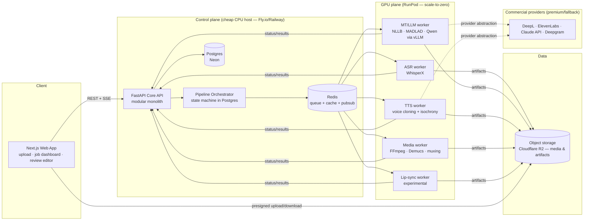

# AI Multimedia Localization Platform — Architecture & Implementation Plan

**Status:** Draft v1 for review — no code exists yet, by design.
**Date:** 2026-07-05
**Context:** Master's thesis + future commercial SaaS. Solo builder.

---

## 1. Vision

A next-generation **AI Multimedia Localization Platform**: upload a video (or audio, or document), receive a fully localized version in target languages — accurate timed subtitles, natural dubbed voice preserving the original speaker's identity and timing, and (eventually) lip-synced video — with a human-in-the-loop review workflow and a measurable quality framework.

Not a translator. A **localization pipeline as a product**: ingestion → understanding → translation → re-synthesis → review → delivery, each stage swappable, measurable, and scalable.

Reference points: Synthesia (avatar/dubbing UX), Netflix (media pipeline engineering, per-title QC), Adobe (creator review tooling), Unbabel (MT + human-in-the-loop + quality estimation).

---

## 2. Confirmed constraints & decisions

| Decision | Choice | Consequence |
|---|---|---|
| Model strategy | **Hybrid, open-source first** | Self-hosted open models are the default engine; commercial APIs (DeepL, ElevenLabs, Claude) are premium tiers / fallbacks behind a provider abstraction. |
| Infrastructure | **Budget GPU cloud** (~$50–150/mo dev) | RunPod/Vast.ai serverless GPU workers + cheap managed control plane (Fly.io/Railway, Neon Postgres, Cloudflare R2). Everything containerized → portable to AWS/GCP later. |
| Priority | **Thesis-first, commercialize later** | Optimize for research evaluation, reproducibility, and a strong demo. Billing, SSO, SOC 2 hardening are designed-for but deferred. |
| MVP scope | Delegated to architect | See §3 — subtitles first, dubbing second, lip-sync as research stretch. |

---

## 3. Scope & phasing (recommendation)

Since you delegated the MVP scope decision, here is my recommendation with reasoning:

### Phase 1 — Subtitles & captions (MVP, thesis core)
Video/audio in → word-timestamped transcript → context-aware translation → broadcast-quality timed subtitles (SRT/VTT/TTML) → **human review editor** → export + quality report.

**Why first:** cheapest pipeline (one GPU-heavy stage: ASR), every later capability depends on it (dubbing needs the same transcript + translation), and it gives the thesis a rigorous, well-benchmarked evaluation story (WER, COMET, subtitle-constraint compliance) on public datasets (MuST-C, CoVoST 2).

### Phase 2 — AI voice dubbing (the differentiator)
Translated segments → voice-cloned TTS in target language → **isochrony fitting** (dubbed speech must fit the original segment durations) → source separation (keep music/effects, replace speech) → remix → dubbed video.

**Why second:** this is where "next-generation" is earned, and it contains the strongest **thesis research contribution**: *isochrony-constrained, LLM-assisted translation for dubbing* — translating not just accurately but to a target syllable/duration budget. This is an active research area (Meta, AppTek, Amazon publish on it) and is tractable for a Master's thesis.

### Phase 3 — Lip-synced video dubbing (research stretch / wow factor)
Face detection → lip re-animation driven by dubbed audio (LatentSync / MuseTalk class models) → composite. Architecturally just another pipeline stage; operationally the heaviest. Ship as "experimental" tier.

### Phase 4 — Document & asset localization (commercial breadth, post-thesis)
Layout-preserving PDF/DOCX/PPTX translation, e-learning packages (SCORM), image text. Different ingestion/rendering path but reuses the entire translation core (MT providers, glossaries, translation memory, review UI, QA).

**Trade-off acknowledged:** doing subtitles-only would be faster but thin for both thesis and product; doing lip-sync first would be spectacular but high-risk on a solo/budget setup. Phases 1+2 together are the right thesis + MVP scope.

---

## 4. Thesis alignment

Candidate research questions the architecture is built to answer:

1. **RQ1:** Does LLM-based context-aware post-editing (document-level context, glossary conditioning) measurably improve subtitle translation quality over sentence-level NMT baselines (NLLB/MADLAD)? — evaluated with COMET/chrF++ + human eval.
2. **RQ2:** Can isochrony-constrained translation (prompting/re-ranking for target duration) improve dubbing naturalness without significant adequacy loss? — evaluated with duration-compliance metrics + MOS listening tests.
3. **RQ3:** How well does an automatic quality-estimation gate (COMET-QE / LLM-as-judge) predict which segments need human review? — precision/recall against human post-edits; this powers the product's HITL routing.

Architectural consequences: every pipeline stage **persists intermediate artifacts** (transcripts, candidate translations, QE scores, timings) so experiments are reproducible; the provider abstraction makes A/B model comparison a first-class feature, not a hack. The platform *is* the experiment harness.

Benchmark datasets: MuST-C / mTEDx (speech translation with subtitles), CoVoST 2, FLEURS (ASR), Heval/dubbing test sets from IWSLT dubbing track.

---

## 5. System architecture overview

**Style: modular monolith control plane + asynchronous GPU worker pool, communicating through a job queue and object storage.**

Why not microservices: Netflix-style microservices solve organizational scaling (hundreds of engineers), which is not your problem. A solo builder pays microservices' full complexity tax (network failure modes, distributed tracing, deploy matrix) with none of the benefit. Instead: **strict internal module boundaries** inside one deployable API, plus physically separate workers (they must be separate anyway — they need GPUs). Modules can be extracted into services later along the same boundaries. This is the honest enterprise-ready answer: *designed for decomposition, not prematurely decomposed.*



Key data-flow principles:

- **Media never flows through the API.** Uploads and downloads go directly browser ↔ R2 via presigned URLs. Workers read/write R2 directly. The control plane only moves metadata and small artifacts (JSON transcripts, SRT files).
- **Every stage is idempotent and resumable.** Stage state lives in Postgres; a stage writes its output artifact to R2, then marks itself complete. Retries re-run only the failed stage — critical when a 40-minute dubbing job dies at minute 38 on a spot GPU.
- **Workers are stateless and scale-to-zero.** RunPod serverless endpoints (or an autoscaled pod pool) spin up per job class. Cold-start (model load) is mitigated by network-volume model caches.

---

## 6. Component breakdown

### 6.1 Frontend — Next.js 15 + TypeScript
- **Stack:** Next.js (App Router), Tailwind CSS, shadcn/ui, TanStack Query, Zustand for editor state.
- **Surfaces:** project dashboard, upload flow, **pipeline progress view** (live stage-by-stage status via SSE), **subtitle/dub review editor** (the product's soul: video player + waveform [wavesurfer.js] + segment table, side-by-side source/target, per-segment QE score, click-to-seek, edit-and-regenerate a single segment's TTS), export screen, quality report.
- Deployed on Vercel free tier during development.
- Trade-off: a dedicated SPA (Vite+React) would be marginally simpler for a pure app, but Next.js gives the marketing site, auth pages, and app in one deployable — right call for a future SaaS.

### 6.2 Core API — FastAPI (Python 3.12)
- **Why Python end-to-end:** the entire ML ecosystem (Whisper, CTranslate2, TTS, pyannote, COMET) is Python. One language across API + workers means shared domain models (Pydantic), shared storage clients, one CI. Node/Go APIs are faster per-request, but this system is throughput-bound on GPUs, not on API latency. FastAPI + Pydantic v2 + SQLAlchemy 2 (async) + Alembic migrations.
- **Internal modules (future service seams):** `identity` (users/orgs/API keys), `projects`, `media` (assets, presigned URLs, probing), `pipelines` (job orchestration), `translation-core` (providers, glossaries, translation memory), `review` (editor state, edit history), `quality` (metrics, QE, reports), `billing` (stub until commercialization).
- **API style:** REST + OpenAPI (auto-generated typed client for the frontend), webhooks for job completion (enterprise later), SSE for live job progress. Versioned under `/v1`.

### 6.3 Orchestration — Postgres-backed state machine + Celery/Redis
Each job is a DAG of stages (e.g., `probe → asr → diarize → segment → translate → qa → subtitle-render` for Phase 1). The DAG definition is data (per pipeline template), execution state lives in Postgres (`pipeline_runs`, `stage_runs`), and stage tasks are dispatched over **Celery with Redis** as broker to queue-per-worker-class (`q.asr`, `q.mt`, `q.tts`, `q.media`).

**Trade-off — why not Temporal/Prefect:** Temporal is the gold standard for durable long workflows and would be the choice with a team; it's also another stateful cluster to operate and a substantial learning curve. Celery is boring, ubiquitous, and sufficient *if* stages are idempotent and the state machine lives in Postgres (which we need anyway for the UI and for thesis artifact tracking). The orchestrator module is small and interface-driven, so migrating dispatch to Temporal post-thesis is contained. Decision: **Celery now, Temporal on the commercial roadmap.**

### 6.4 GPU workers — containerized Python, RunPod
- One container image per worker class, models baked or volume-cached (RunPod network volumes) to cut cold starts.
- Serverless GPU endpoints for bursty dev usage (pay per second, scale to zero — fits the budget); dedicated spot pods once utilization justifies it.
- Inference runtimes: **faster-whisper / WhisperX** (CTranslate2), **CTranslate2** for NLLB/MADLAD, **vLLM** for the LLM (Qwen) when a persistent endpoint is warranted — during development, LLM post-editing can use the Claude API or a RunPod vLLM serverless endpoint instead of a dedicated GPU.
- Workers pull tasks, stream progress heartbeats to Redis (surfaced via SSE), write artifacts to R2, report terminal status to the API.

### 6.5 Provider abstraction (the hybrid strategy, concretely)
Every AI capability is a Python interface with N adapters:

| Capability | Interface | Open-source default | Commercial premium/fallback |
|---|---|---|---|
| ASR | `TranscriptionProvider` | WhisperX (large-v3) | Deepgram / AssemblyAI |
| MT | `TranslationProvider` | MADLAD-400 / NLLB-200 | DeepL, Claude |
| LLM (post-edit, QA, isochrony) | `LLMProvider` | Qwen2.5-Instruct via vLLM | Claude API |
| TTS + cloning | `SpeechProvider` | Chatterbox / CosyVoice 2 | ElevenLabs |
| Quality estimation | `QEProvider` | COMET / COMET-QE | LLM-as-judge (either LLM) |

Provider choice is a per-job (and per-plan-tier) parameter, recorded in the run record → this is simultaneously the SaaS pricing-tier mechanism and the thesis A/B experiment mechanism.

---

## 7. Model selection matrix

**⚠️ Licensing is a first-class architectural concern.** Several state-of-the-art open models have **non-commercial weights** — fine for the thesis, unusable in the SaaS. The platform must keep a license register per provider adapter. Verify all licenses at implementation time; summary as of mid-2026:

| Stage | Model | Quality | License | Commercial OK? | Notes |
|---|---|---|---|---|---|
| ASR | Whisper large-v3 via **WhisperX** | Excellent, 90+ langs | MIT (BSD for WhisperX) | ✅ | Word-level timestamps + VAD; pyannote diarization models require HF gated access (free) |
| ASR alt | distil-whisper / Parakeet | Faster, fewer langs | MIT / CC-BY | ✅ | Cost optimization later |
| MT | **MADLAD-400-10B/3B** | Very good, 400+ langs | Apache 2.0 | ✅ | Primary commercial-safe NMT |
| MT | NLLB-200-3.3B | Very good, 200 langs | **CC-BY-NC 4.0** | ❌ thesis only | Strong baseline for the thesis eval |
| MT/LLM | Qwen2.5-7B/14B-Instruct | Excellent w/ context | Apache 2.0 | ✅ | Context-aware translation + post-editing + isochrony rewriting |
| TTS+clone | **Chatterbox** (Resemble) | Very good cloning | MIT | ✅ | Primary open cloning TTS |
| TTS+clone | CosyVoice 2 | Very good, strong zh/en | Apache 2.0 | ✅ | Second engine, language coverage differs |
| TTS+clone | XTTS-v2 | Good | **Coqui CPML (NC)** | ❌ thesis only | |
| TTS+clone | F5-TTS | Excellent | Code MIT, **weights CC-BY-NC** | ❌ thesis only | |
| Source separation | Demucs (htdemucs) | SOTA | MIT | ✅ | Split speech from music/FX before remix |
| Lip-sync | LatentSync | SOTA-ish | Apache 2.0 | ✅ verify | Phase 3 |
| Lip-sync | MuseTalk / Wav2Lip | Good / dated | verify / **NC** | ⚠️ | Wav2Lip academic-only |
| Quality | COMET (wmt22-comet-da), chrF++, jiwer (WER) | — | Apache / open | ✅ | Note some newer COMET variants (XCOMET) are NC |

**Voice-cloning governance (non-negotiable even in beta):** explicit consent attestation for any cloned voice, cloned-voice registry per org, audio watermarking on generated speech where feasible, and ToS prohibiting impersonation. This is both an ethics requirement for the thesis and table stakes for enterprise sales (EU AI Act transparency obligations for synthetic media apply).

---

## 8. Pipeline designs

### 8.1 Phase 1 — Subtitle pipeline
```
probe(ffprobe) → extract-audio(ffmpeg) → asr(WhisperX: words+timestamps)
→ diarize(pyannote, optional) → subtitle-segment(rule-based: CPS/CPL/duration constraints)
→ translate(provider; document-level context window + glossary)
→ llm-post-edit(optional tier: idiom, formality, length fit)
→ qe-score(COMET-QE per segment) → render(SRT/VTT/TTML) → [human review] → export + quality report
```
Subtitle segmentation enforces broadcast constraints (chars/line, chars/sec, min/max duration, line breaks at syntactic boundaries) — this professional detail is what separates the product from "Whisper + Google Translate" toys, and it's measurable for the thesis.

### 8.2 Phase 2 — Dubbing pipeline (extends 8.1)
```
[8.1 through translate] → isochrony-fit(LLM rewrites/re-ranks translation to duration budget per segment)
→ voice-ref-extract(clean source-speaker samples via diarization + separation)
→ tts(cloned voice, per segment) → time-align(atempo stretch within ±10%, re-fit loop if over budget)
→ separate(Demucs: music/FX bed from original) → mix(dubbed speech + bed, ducking, loudness normalize EBU R128)
→ mux(ffmpeg) → [review: per-segment listen + regenerate] → export
```
The `isochrony-fit → tts → time-align` feedback loop is the RQ2 research core.

### 8.3 Phase 3 — Lip-sync (experimental stage appended to 8.2)
`face-detect/track → lip-generate(LatentSync) → composite → mux`. Isolated worker class, GPU-heavy (budget: minutes of A40+ time per video minute), feature-flagged.

---

## 9. Data model (core entities)

```
Org ─< Member(User, role)
Org ─< Project ─< MediaAsset (source files; R2 keys, probe metadata)
Project ─< Glossary ─< GlossaryEntry            # termbase, per language pair
Project ─< TranslationMemory ─< TMEntry          # grows from approved human edits
Org ─< Voice (cloned voice registry + consent record)

MediaAsset ─< PipelineRun (template, provider config, tier, cost accounting)
PipelineRun ─< StageRun (status, timings, worker id, input/output artifact refs, error)
PipelineRun ─< Transcript ─< Segment (t_start, t_end, speaker, source_text, words[])
Segment ─< Translation (target_lang, provider, candidate_rank, qe_score, isochrony_fit)
Segment ─< EditEvent (human post-edits — audit trail + thesis data + TM feed)
PipelineRun ─< OutputArtifact (SRT/VTT/audio/video renditions)
PipelineRun ─< QualityReport (aggregate metrics per stage/language)
```

Multi-tenancy: single Postgres, `org_id` on every tenant-scoped row, enforced in a repository layer (Postgres RLS as defense-in-depth when commercializing). All timestamps/artifacts retained → reproducible experiments and future TM/fine-tuning data.

---

## 10. Infrastructure & DevOps

| Concern | Development (now) | Commercial (later) |
|---|---|---|
| Control plane | Fly.io or Railway (API + Celery beat), ~$5–15/mo | AWS ECS/EKS or GCP Cloud Run via same containers |
| Postgres | Neon free/launch tier | RDS / Cloud SQL, PITR |
| Redis | Upstash / Fly Redis | ElastiCache / Memorystore |
| Object storage | **Cloudflare R2** (zero egress — decisive for media serving) | R2 or S3 + CloudFront |
| GPU | RunPod serverless endpoints, scale-to-zero | Dedicated spot pool + serverless burst; K8s if warranted |
| IaC | Docker Compose (full local stack, CPU/small-model mode) + Terraform for cloud resources from day one | Same Terraform, bigger targets |
| CI/CD | GitHub Actions: lint (ruff), typecheck (mypy/pyright, tsc), tests (pytest, Vitest), build+push images, deploy | + staging env, migration gates, canary |
| Secrets | Platform-native (Fly secrets) + doppler/1Password | Vault/SSM |

Estimated dev-phase GPU cost: ASR ≈ 0.1× realtime on a 4090 (~$0.70/hr) → a 10-min video ≈ 1 GPU-min ≈ $0.01; full dubbing job ≈ 5–10 GPU-min ≈ $0.06–0.12. Even heavy experimentation stays within $50–150/mo. Lip-sync is the exception (≈ realtime or slower on A40) — feature-flag it.

## 11. Security, privacy, compliance

- Presigned, expiring, content-type-constrained upload/download URLs; private buckets; per-org key prefixes.
- Encryption in transit everywhere; at rest via R2/Neon defaults.
- Auth: **Auth.js** (open-source, owns the user table) with email+OAuth; API keys for programmatic access; org-scoped RBAC (owner/editor/viewer). SSO/SAML via WorkOS or Keycloak on the enterprise roadmap.
- GDPR + Swiss FADP posture from the start (you're EU-adjacent): data-deletion endpoint that cascades R2 artifacts, processing register, EU-region hosting options (Neon/Fly/R2 all offer EU regions).
- EU AI Act: synthetic-media transparency (label dubbed output, watermark where feasible) + the voice-consent registry (§7).
- Rate limiting + upload size/duration quotas per plan tier (also your cost-control mechanism).

## 12. Observability

- **OpenTelemetry** traces from API through Celery to workers (one trace per pipeline run — debugging distributed media pipelines without this is misery).
- Sentry (errors, FE+BE), Grafana Cloud free tier (Prometheus metrics + Loki logs): queue depth, stage duration percentiles per model, GPU-seconds per job, cost per job.
- Per-run structured audit log doubles as thesis experiment log.

## 13. Evolution path (monolith → enterprise)

Extraction order when scale/team demands it: (1) media/ingest service, (2) translation-core as an internal platform service, (3) Temporal for orchestration, (4) dedicated GPU fleet w/ K8s + KEDA queue-based autoscaling. Module boundaries in §6.2 are the pre-drawn cut lines. Billing (Stripe, credit-metering on GPU-seconds) slots into the existing `PipelineRun` cost accounting.

---

## 14. Key trade-off decisions (ADR summary)

| # | Decision | Alternatives rejected | Why |
|---|---|---|---|
| 1 | Modular monolith + workers | Microservices | Solo builder; org-scaling problem doesn't exist; seams pre-drawn |
| 2 | Python/FastAPI end-to-end | Node/NestJS, Go API | ML ecosystem gravity; GPU-bound not API-bound |
| 3 | Celery/Redis + Postgres state machine | Temporal, Prefect | Operational simplicity now; Temporal is the planned upgrade |
| 4 | RunPod serverless GPU | AWS GPU, own hardware | Scale-to-zero fits budget; containers keep it portable |
| 5 | Cloudflare R2 | S3 | Zero egress fees — dominant cost factor for media delivery |
| 6 | MADLAD/Qwen as commercial-safe MT core | NLLB-only | NLLB weights are CC-BY-NC — thesis baseline only |
| 7 | Chatterbox/CosyVoice2 for TTS | XTTS-v2, F5-TTS | License: MIT/Apache vs non-commercial weights |
| 8 | Next.js | Vite SPA | One deployable for site+app; SaaS-ready |
| 9 | Auth.js self-hosted | Clerk, Supabase Auth | Open-source-first, no per-MAU cost, owns user data |
| 10 | Subtitles → dubbing → lip-sync phasing | Lip-sync-first | Risk/budget; dubbing isochrony is the thesis contribution |

## 15. Implementation roadmap

| Milestone | Duration | Deliverable |
|---|---|---|
| **M0 — Foundations** | 2 wks | Monorepo, Docker Compose local stack, CI, Terraform skeleton, auth, orgs/projects, presigned upload, ffprobe stage — a file goes in and metadata comes out, end to end |
| **M1 — Transcription** | 3 wks | ASR worker on RunPod, WhisperX + diarization, live progress UI, transcript viewer/editor |
| **M2 — Subtitle MVP** | 4 wks | Segmentation w/ broadcast constraints, MT providers (MADLAD + NLLB + DeepL), SRT/VTT export, review editor v1 |
| **M3 — Quality framework** | 3 wks | COMET/QE integration, LLM post-edit stage, quality reports, benchmark harness on MuST-C → **first thesis results (RQ1, RQ3)** |
| **M4 — Dubbing** | 5 wks | TTS workers (Chatterbox/CosyVoice2 + ElevenLabs), voice registry + consent, isochrony loop, Demucs separation + remix, per-segment regenerate in editor |
| **M5 — Dubbing evaluation** | 3 wks | Isochrony metrics, MOS study tooling → **thesis results (RQ2)** |
| **M6 — Hardening / stretch** | 4 wks | Lip-sync experimental stage, polish, load test, thesis demo build; (post-thesis: Stripe billing, tiers, SSO) |

~24 weeks of focused work; realistically 7–9 months alongside thesis writing.

## 16. Open questions for the product owner

1. **Target language pairs** for thesis evaluation (source ↔ targets)? This drives model choice — e.g., Tamil/Indic targets favor different TTS/MT choices than FR/DE/ES.
2. Thesis **submission deadline** — hard date to anchor M0–M5 against?
3. University resources: **GPU cluster or cloud credits** available? Could replace RunPod for experiments.
4. Any existing supervisor requirements on the research question, or is the RQ selection in §4 open to negotiation?
5. Product name/domain — needed before M0 only for repo naming.
