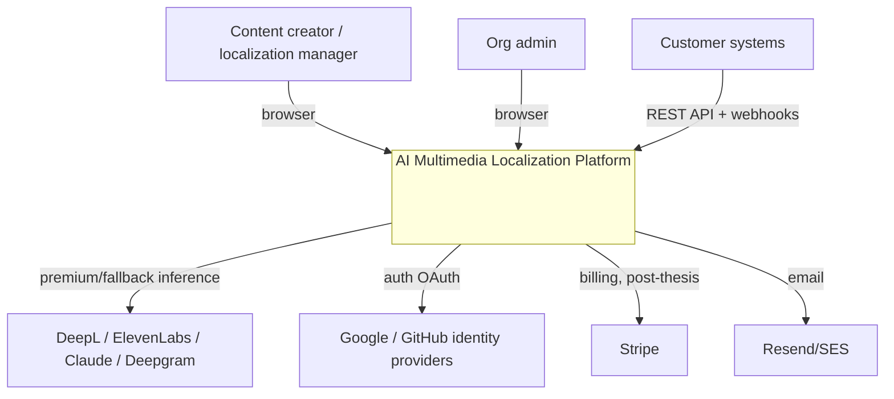
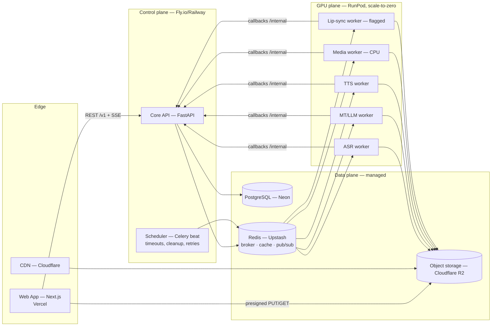
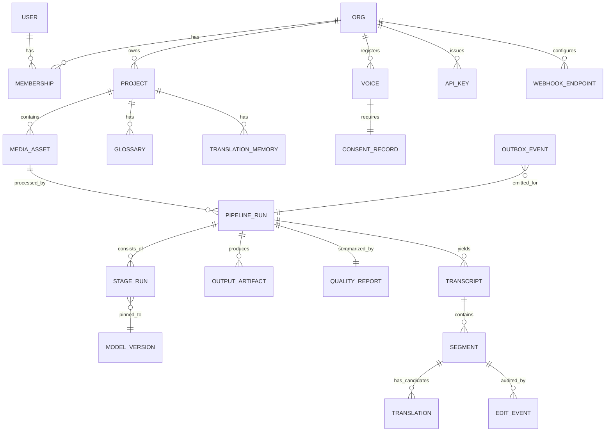

# Software Architecture Document (SAD)
## AI Multimedia Localization Platform

| | |
|---|---|
| **Document** | Software Architecture Document |
| **Version** | 1.0 (Draft for review) |
| **Date** | 2026-07-05 |
| **Author** | Chief Software Architect (AI-assisted) |
| **Audience** | Product owner, thesis supervisor, future engineering hires |
| **Companion doc** | [ARCHITECTURE.md](ARCHITECTURE.md) — vision, scoping rationale, model licensing matrix, roadmap |
| **Status of code** | None. This document precedes implementation by design. |

**Purpose.** This document specifies the software architecture of the AI Multimedia Localization Platform: a system that ingests video, audio, and documents and produces localized outputs (timed subtitles, voice-cloned dubbing, lip-synced video) through AI pipelines with human-in-the-loop review. It defines structure, technology selections, interfaces, cross-cutting concerns, and the evolution path from thesis prototype to commercial SaaS.

**Architectural drivers (from confirmed requirements):**
- Hybrid AI strategy — open-source models self-hosted by default, commercial APIs as premium tiers/fallbacks, all behind provider abstractions.
- Budget-constrained infrastructure (~$50–150/mo development) with a credible path to enterprise cloud.
- Thesis-first: reproducibility, artifact persistence, and A/B model evaluation are first-class requirements, not afterthoughts.
- Solo builder: operational simplicity outranks architectural fashion; every component must justify its maintenance cost.

---

## Table of contents

1. [Overall system architecture](#1-overall-system-architecture)
2. [Frontend architecture](#2-frontend-architecture)
3. [Backend architecture](#3-backend-architecture)
4. [AI architecture](#4-ai-architecture)
5. [Microservices](#5-microservices)
6. [REST APIs](#6-rest-apis)
7. [WebSockets & real-time](#7-websockets--real-time)
8. [gRPC](#8-grpc)
9. [Background workers](#9-background-workers)
10. [Cloud architecture](#10-cloud-architecture)
11. [Database architecture](#11-database-architecture)
12. [Authentication & authorization](#12-authentication--authorization)
13. [Storage architecture](#13-storage-architecture)
14. [GPU architecture](#14-gpu-architecture)
15. [CI/CD](#15-cicd)
16. [Security](#16-security)
17. [Monitoring](#17-monitoring)
18. [Logging](#18-logging)
19. [Folder structure](#19-folder-structure)
20. [Scalability](#20-scalability)

---

## 1. Overall system architecture

### 1.1 Architectural style

**Modular monolith control plane + asynchronous GPU worker plane**, mediated by a message queue and object storage. Logical service boundaries are defined now (§5); physical decomposition into microservices is a staged, criteria-driven evolution, not a day-one deployment.

### 1.2 System context (C4 Level 1)



### 1.3 Container view (C4 Level 2)



### 1.4 Architectural principles

| # | Principle | Practical meaning |
|---|---|---|
| P1 | **Media bypasses the control plane** | Uploads/downloads go browser ↔ R2 via presigned URLs; API moves metadata only. Keeps the API host tiny and cheap. |
| P2 | **Stages are idempotent, resumable units** | Every pipeline stage: reads artifacts from R2, writes artifacts to R2, records state in Postgres. Retry = re-run stage, never the whole job. |
| P3 | **Everything AI sits behind a provider interface** | Model/provider selection is per-job configuration → simultaneously the SaaS tier mechanism and the thesis A/B harness. |
| P4 | **Artifacts are immutable and versioned** | No stage overwrites its input. Enables reproducibility (thesis), audit (enterprise), and safe retries. |
| P5 | **Designed for decomposition, not prematurely decomposed** | Module boundaries = future service boundaries. Extraction criteria defined in §5.4. |
| P6 | **Boring technology wherever the product isn't differentiated** | Postgres, Redis, Celery, FFmpeg. Novelty budget is spent on the AI pipeline only. |

### 1.5 Quality attribute targets

| Attribute | Target (dev/thesis) | Target (commercial) |
|---|---|---|
| API availability | Best effort | 99.9 % |
| Job durability | No job lost after acceptance (Postgres-recorded) | Same + multi-region queue failover |
| Pipeline latency | Subtitles ≤ 0.3× media duration; dubbing ≤ 1× | Same, with priority queues per tier |
| Interactive API latency | p95 < 300 ms | p95 < 150 ms |
| Recovery | Stage-level retry; RPO = last completed stage | + PITR database, cross-region artifact replication |
| Cost | ≤ $150/mo | Gross margin ≥ 70 % per job (metered) |

---

## 2. Frontend architecture

### 2.1 Stack

Next.js 15 (App Router) · TypeScript (strict) · Tailwind CSS + shadcn/ui · TanStack Query (server state) · Zustand (editor state) · wavesurfer.js (waveform) · generated OpenAPI client. Deployed on Vercel.

### 2.2 Application structure

Three route groups with distinct rendering strategies:

| Group | Rendering | Content |
|---|---|---|
| `(marketing)` | Static/ISR | Landing, pricing, docs — SEO-relevant |
| `(auth)` | Server-rendered | Sign-in/up, org invitations |
| `(app)` | Client-heavy, authenticated | Dashboard, projects, pipeline runs, review editor, admin |

### 2.3 State management model

- **Server state** (projects, runs, transcripts): TanStack Query exclusively — cache keys mirror REST resources; mutations invalidate by key. No server data is duplicated into client stores.
- **Editor state** (selected segment, playhead, pending edits, undo stack): Zustand store, local to the editor route; persisted edits flow through mutations with optimistic updates.
- **Live progress**: SSE subscription per active `PipelineRun` feeds directly into the Query cache (patch-by-event), so the dashboard and editor render from a single source of truth.

### 2.4 The review editor (flagship surface)

Layered component architecture: `<MediaProvider>` (video element + wavesurfer, single time authority) → `<SegmentList>` (virtualized — hour-long media yields thousands of segments) → `<SegmentRow>` (source/target text, per-segment QE score badge, speaker chip, dubbing controls: listen/regenerate) → `<ExportPanel>`. All time-coupled components subscribe to the playhead via the store; seeking is bidirectional (click segment ↔ scrub waveform). Segment edit history is captured as `EditEvent`s (thesis data + translation-memory feed).

### 2.5 Cross-cutting frontend concerns

- **Type safety end-to-end:** the OpenAPI schema from FastAPI generates the TypeScript client in CI; a backend contract change that breaks the frontend fails the build, not production.
- **Uploads:** direct-to-R2 multipart with presigned URLs; resumable for large video; client-side probe (duration, codec) for early validation.
- **Error handling:** problem+json errors (§6.5) rendered by a single error boundary taxonomy (retryable / actionable / fatal).
- **i18n of the UI itself** via next-intl (a localization product must be localized); WCAG 2.1 AA targeted for the editor (full keyboard operation).

---

## 3. Backend architecture

### 3.1 Stack

Python 3.12 · FastAPI · Pydantic v2 (all I/O contracts) · SQLAlchemy 2 async + Alembic · Celery 5 (Redis broker) · httpx (provider calls) · structlog (§18).

### 3.2 Layered structure within the modular monolith

```
HTTP layer      → routers (FastAPI): validation, auth context, serialization. No business logic.
Service layer   → application services per module: use-cases, transactions, event emission.
Domain layer    → entities, value objects (Timecode, LanguagePair, SegmentConstraint), domain rules.
Adapter layer   → repositories (Postgres), storage client (R2), queue publisher, provider adapters (§4).
```

Dependency rule: outer layers depend inward; the domain layer imports nothing above it. Modules communicate through service interfaces and domain events — never by reaching into another module's tables.

### 3.3 Module catalog (= future service seams, §5)

| Module | Owns | Key invariants |
|---|---|---|
| `identity` | users, orgs, memberships, API keys | all authz decisions |
| `projects` | projects, settings, language pairs | tenant scoping |
| `media` | assets, probing, presigned URL issuance | media never transits API |
| `pipelines` | run/stage state machine, dispatch, callbacks | stage idempotency, exactly-once completion |
| `translation-core` | providers, glossaries, translation memory | license/tier enforcement per provider |
| `review` | editor sessions, edit events, approvals | edit audit trail completeness |
| `quality` | metrics, QE scores, reports, benchmark harness | reproducibility of every score |
| `voices` | cloned-voice registry, consent records | no synthesis without consent record |
| `billing` (stub) | cost accounting per run | GPU-seconds metered from day one |
| `notifications` | email, webhooks | at-least-once webhook delivery + signing |

### 3.4 Request & job lifecycle

1. Client `POST /v1/runs` → `pipelines` service validates plan/tier/quota, materializes the stage DAG from a pipeline template, persists `PipelineRun` + `StageRun`s (status `pending`), enqueues the first ready stage(s), returns `202` with the run resource.
2. Worker picks up stage task → transitions `running` (heartbeats to Redis) → writes output artifact(s) to R2 → calls back `POST /internal/stages/{id}/complete` (authenticated, §12.4).
3. Orchestrator marks stage `succeeded`, enqueues newly unblocked stages; on terminal failure after retries, marks run `failed` with a structured error. All transitions are guarded by optimistic locking — duplicate worker callbacks are no-ops (idempotency keys).
4. Every transition emits a domain event → SSE broadcast (§7), webhook fan-out, audit log.

### 3.5 Consistency & transactions

Single Postgres = simple transactional core. The only distributed operations are (a) queue publish after commit — handled by a transactional outbox table drained by the scheduler, guaranteeing no ghost tasks and no lost tasks; (b) R2 writes — idempotent by deterministic artifact keys (§13.3).

---

## 4. AI architecture

### 4.1 Provider abstraction layer

Every AI capability is a narrow interface with multiple adapters (see licensing matrix in [ARCHITECTURE.md §7](ARCHITECTURE.md)):

| Interface | Contract (conceptual) | Adapters (default → premium) |
|---|---|---|
| `TranscriptionProvider` | audio ref → words[{text, t0, t1, conf}], language, speakers? | WhisperX → Deepgram |
| `TranslationProvider` | segments + context + glossary → candidates[{text, score}] | MADLAD-400 / NLLB (thesis) → DeepL |
| `LLMProvider` | task-typed prompts (post-edit, isochrony-rewrite, judge) → structured output | Qwen2.5 (vLLM) → Claude API |
| `SpeechProvider` | text + voice ref + duration budget → audio ref + achieved duration | Chatterbox / CosyVoice 2 → ElevenLabs |
| `QEProvider` | source, hypothesis → quality score + subscores | COMET-QE → LLM-as-judge |

Adapter selection is resolved per run from: requested tier → org plan → license register (a provider flagged non-commercial is unselectable outside research mode) → language-pair capability map → health status (circuit breaker; fallback chain is explicit configuration, and every fallback is recorded on the run for cost and thesis integrity).

### 4.2 Model registry & versioning

A `ModelVersion` record (name, revision/hash, runtime, quantization, license, language coverage, cost basis) is referenced by every `StageRun`. **No stage executes against an unpinned model.** This gives the thesis exact reproducibility and gives the SaaS controlled rollouts (new model version = new registry entry, canaried via per-org routing).

### 4.3 Pipeline stage graph

Pipelines are declarative templates (DAG of typed stages with parameter schemas), stored as data. Phase 1 subtitle template and Phase 2 dubbing template are specified in [ARCHITECTURE.md §8](ARCHITECTURE.md). New capabilities (lip-sync, document localization) are new stage types + templates — no orchestrator changes.

### 4.4 Prompt & configuration management

LLM prompts (post-editing, isochrony rewriting, LLM-as-judge rubrics) are versioned artifacts in the repo, referenced by hash in run records — a prompt change is a tracked experiment variable, same discipline as a model change.

### 4.5 Evaluation & data flywheel

- **Offline harness:** benchmark runner executes pipeline templates against public test sets (MuST-C, CoVoST 2, FLEURS), emitting per-configuration scorecards (WER, COMET, chrF++, subtitle-constraint compliance, isochrony fit). This is thesis infrastructure and pre-release regression gating for model upgrades.
- **Online signals:** human `EditEvent`s produce edit-distance-per-segment; QE-vs-human-edit correlation calibrates the review-routing threshold (RQ3).
- **Flywheel:** approved human edits feed the org's translation memory; TM hits short-circuit MT on repeat content (cost ↓, consistency ↑).

### 4.6 GPU inference runtimes

faster-whisper/WhisperX (CTranslate2) for ASR · CTranslate2 for NMT · vLLM for LLM serving (persistent endpoint only when utilization justifies; Claude API otherwise) · native PyTorch for TTS/separation/lip-sync. Quantization defaults: int8/float16 where quality-neutral (validated by the offline harness before adoption).

---

## 5. Microservices

### 5.1 Position

The system is **service-oriented in design, monolithic in initial deployment**. Ten logical services exist from day one as enforced modules (§3.3) with private data, explicit interfaces, and event-based interaction. Physical extraction is deferred deliberately: for a solo builder, premature microservices convert a product problem into a distributed-systems problem. This section defines the target state and the trigger criteria.

### 5.2 Logical service catalog & extraction order

| Order | Service | Extraction trigger | Notes when extracted |
|---|---|---|---|
| — | GPU workers | **Already separate** (deployed independently, own lifecycle) | They are microservices in all but name |
| 1 | `media-service` | Upload/probe traffic interferes with API latency | Stateless; easiest cut |
| 2 | `translation-core` | Second consumer appears (document pipeline, public MT API) | Becomes internal platform service |
| 3 | `orchestrator` | Workflow complexity outgrows Celery + state machine | Replatform onto Temporal at the same time |
| 4 | `identity` | SSO/SCIM/enterprise audit demands | Or replace with Keycloak/WorkOS |
| 5 | `quality`, `notifications`, `billing` | Team size / independent scaling need | Low coupling; late cuts |

### 5.3 Communication rules (apply now and after extraction)

- Synchronous calls only client→API and API→provider; **service-to-service interaction is event-driven by default** (outbox → queue), keeping temporal coupling out of the architecture before services even exist.
- Each module/service owns its tables exclusively; cross-domain reads go through the owning service's interface. This is enforced in the monolith by code review + import-linting so extraction never requires untangling shared tables.
- Sagas: the pipeline state machine already is one (compensation = stage retry / run abort + artifact GC), so long-running-transaction discipline predates decomposition.

### 5.4 Extraction criteria (all must hold)

1. The boundary has demonstrated stability (low cross-module churn in git history).
2. Independent scaling, deployment cadence, or fault isolation delivers measurable value.
3. Operating budget exists for the added deploy target, dashboards, and on-call surface.

---

## 6. REST APIs

### 6.1 Conventions

- Base path `/v1`, versioned by URL; additive changes never bump versions, breaking changes do (with deprecation windows).
- Resource-oriented nouns, kebab-case paths, camelCase JSON. Server-generated IDs are prefixed ULIDs (`run_01H…`, `seg_01H…`) — sortable, non-enumerable, self-describing in logs.
- All list endpoints: cursor pagination (`?cursor=&limit=`), consistent envelope `{data, nextCursor}`.
- Long-running operations return `202 Accepted` + a run resource; **no request ever blocks on GPU work**.
- Mutations accept an `Idempotency-Key` header (stored 24 h) — required for run creation and export endpoints.

### 6.2 Resource catalog (v1)

| Resource | Operations | Notes |
|---|---|---|
| `/orgs`, `/orgs/{id}/members` | CRUD, invite | RBAC (§12.3) |
| `/projects` | CRUD | language pairs, defaults |
| `/projects/{id}/assets` | create (→ presigned upload), get, list, delete | `POST …/assets:confirm` finalizes after direct upload |
| `/assets/{id}/runs` · `/runs/{id}` | create, get, list, cancel | pipeline template + provider config in body |
| `/runs/{id}/stages` | list | live status, timings, artifact refs |
| `/runs/{id}/transcript` · `/segments/{id}` | get, patch | review edits; PATCH emits `EditEvent` |
| `/segments/{id}/translations` | list, select, regenerate | candidate management |
| `/segments/{id}:redub` | action | single-segment TTS regeneration |
| `/runs/{id}/exports` | create, get | SRT/VTT/TTML/audio/video renditions (presigned download) |
| `/runs/{id}/quality-report` | get | aggregate metrics |
| `/glossaries`, `/translation-memories` | CRUD, import/export (TBX/TMX) | professional interop |
| `/voices` | create (consent-gated), list, delete | consent artifact mandatory |
| `/webhooks` | CRUD + test delivery | HMAC-signed (§6.4) |
| `/api-keys` | create, roll, revoke | programmatic access |

### 6.3 Documentation & clients

OpenAPI 3.1 generated from code (FastAPI) is the single contract: renders the public API docs, generates the frontend TS client (CI-enforced, §2.5), and later customer SDKs.

### 6.4 Webhooks

Events (`run.completed`, `run.failed`, `export.ready`, …) delivered at-least-once with exponential backoff (24 h horizon), HMAC-SHA256 signature + timestamp header (replay window 5 min), per-endpoint secret rolling.

### 6.5 Errors

RFC 9457 `application/problem+json` uniformly: `type` (stable URI slug), `title`, `status`, `detail`, `traceId`, and domain extensions (e.g., `stage`, `providerError`). Rate limiting: token bucket per API key/org (Redis), standard `RateLimit-*` headers, `429` + `Retry-After`.

---

## 7. WebSockets & real-time

### 7.1 Decision: SSE first, WebSocket where bidirectionality is real

| Channel | Need | Transport |
|---|---|---|
| Pipeline progress (dashboard, run view) | Server→client only, resumable | **SSE** `GET /v1/runs/{id}/events` |
| Review editor presence & co-editing (post-thesis, multi-user orgs) | Bidirectional, low latency | **WebSocket** `/v1/ws/editor/{runId}` |
| Worker → control plane | Already covered by queue + callbacks | none |

Rationale: SSE is plain HTTP — works through proxies and serverless edges, auto-reconnects natively with `Last-Event-ID` (missed-event replay from a short Redis stream), and costs near-zero complexity. WebSockets are reserved for the collaborative-editor feature, where they are genuinely required. This avoids operating a stateful WS fleet during the thesis phase.

### 7.2 Event flow & scaling

Domain events (stage transitions, QE scores, export ready) → transactional outbox → Redis pub/sub channel per run → any API replica streams to its subscribers. API replicas stay stateless w.r.t. real-time (any replica can serve any stream), so horizontal scaling of SSE is trivial; WS scaling later uses the same pub/sub backplane with sticky-session-free design.

### 7.3 Contract & auth

Events are typed, versioned envelopes `{id, type, runId, ts, data}` — the same schema as webhook payloads (one event contract, three consumers: SSE, webhooks, audit log). Auth: standard session/API-key on the HTTP request; short-lived signed ticket for WS upgrade. Heartbeat comments every 25 s hold intermediary connections open.

---

## 8. gRPC

### 8.1 Position: not in the initial deployment — adoption criteria defined

Current internal communication is queue-based (Celery/Redis) with HTTP callbacks; both hops are asynchronous by nature, which a job platform wants. gRPC's strengths (typed contracts, streaming, low per-call overhead) become decisive only when **synchronous, high-frequency, service-to-service calls** exist — which the §5 decomposition eventually creates.

### 8.2 Planned adoption map

| Interface | When | Why gRPC fits |
|---|---|---|
| API/orchestrator ↔ extracted `translation-core` | Service extraction #2 (§5.2) | High-frequency internal calls (per-segment MT/QE); protobuf contracts across the boundary |
| Orchestrator ↔ persistent GPU inference endpoints (vLLM/Triton) | When dedicated GPU pool replaces serverless | Both natively speak gRPC; server-streaming for token/progress streams |
| Real-time worker progress streaming | Optional, replaces Redis heartbeats at scale | Long-lived server-streams with backpressure |

### 8.3 Governance (decided now so adoption is cheap later)

Proto definitions will live in `packages/proto` (§19) as the single IDL source; buf for linting/breaking-change detection in CI; gRPC only ever on **internal** networks — the public contract remains REST/OpenAPI (browser compatibility, customer ergonomics). Internal auth via mTLS between services (§16). This section exists so that introducing gRPC is a build task, not an architecture change.

---

## 9. Background workers

### 9.1 Worker classes & queues

| Queue | Worker class | Hardware | Concurrency model |
|---|---|---|---|
| `q.media` | FFmpeg probe/extract/mux/render | CPU (cheap) | prefork, high concurrency |
| `q.asr` | WhisperX + pyannote | GPU 16–24 GB | 1 task/GPU, batched internally |
| `q.mt` | CTranslate2 NMT + LLM calls | GPU 24 GB / API | segment-batched |
| `q.tts` | Chatterbox/CosyVoice + alignment | GPU 16–24 GB | per-segment tasks, batched |
| `q.lipsync` | LatentSync (flagged) | GPU 48 GB | 1 task/GPU |
| `q.control` | orchestration ticks, outbox drain, webhooks, GC | CPU (in control plane) | lightweight |

Queue-per-class (not one shared queue) so a lip-sync backlog can never starve subtitle jobs, and each class autoscales on its own depth.

### 9.2 Task lifecycle & reliability

- **Idempotency:** task payload = `{stageRunId, attempt}`; workers check current stage state before executing and write artifacts to deterministic keys — duplicate delivery is harmless (at-least-once delivery assumed).
- **Retries:** exponential backoff with jitter; max attempts per stage type (transient infra errors retried; deterministic model errors fail fast to the review UI). Poison tasks → dead-letter queue with full context for inspection.
- **Heartbeats & reaping:** workers heartbeat per task (Redis TTL key); the scheduler reaps stages whose heartbeat lapsed (spot GPU death) and re-enqueues within attempt budget — this is the core defense for preemptible GPU economics.
- **Priorities:** per-queue priority lanes (interactive single-segment redub from the editor outranks batch jobs).
- **Timeouts:** per stage type, scaled by media duration (a 3-hour film legitimately transcribes for a long time; a 3-minute clip that runs 30 min is dead).

### 9.3 Scheduled work (`Celery beat`)

Outbox drain, heartbeat reaper, artifact GC (orphaned uploads, expired exports), webhook retry sweep, nightly benchmark harness runs, cost-accounting rollups.

---

## 10. Cloud architecture

### 10.1 Development/thesis topology (target ≤ $150/mo)

| Layer | Provider | Sizing | Est. cost |
|---|---|---|---|
| Frontend | Vercel | hobby/pro | $0–20 |
| Control plane (API + scheduler + control worker) | Fly.io or Railway, 2 small VMs | shared-cpu 1–2 GB | $10–25 |
| Postgres | Neon (EU region) | launch tier | $0–19 |
| Redis | Upstash (EU) | pay-per-request | $0–10 |
| Object storage | Cloudflare R2 | ~100 GB, **zero egress** | $2–5 |
| GPU | RunPod serverless (EU/US), scale-to-zero | 4090/A40 per-second | $20–80 usage-based |
| Observability | Grafana Cloud + Sentry free tiers | — | $0 |

### 10.2 Commercial topology (same containers, bigger targets)

Terraform-managed migration to AWS (or GCP — containers keep this a re-pointing exercise): ECS/EKS for control plane, RDS Postgres Multi-AZ, ElastiCache, S3+CloudFront or retained R2, dedicated GPU pool (spot + on-demand mix, §14.4) with RunPod/serverless burst overflow. EU region primary (GDPR/FADP posture, §16.4); static assets and exports on CDN.

### 10.3 Portability guarantees

Everything ships as OCI containers; storage via S3-compatible API only; queue via broker abstraction; no provider-proprietary service (no Lambda, no DynamoDB) in the core path. The exit cost from any single vendor is configuration, not code.

---

## 11. Database architecture

### 11.1 PostgreSQL as the transactional core

Single Postgres cluster (Neon; RDS later) holding all control-plane state. Media and large artifacts live in R2 — **the database stores references, metadata, and text**, never blobs (exception: subtitle text and transcripts, which are legitimately relational/searchable).

### 11.2 Schema domains (ERD summary)



### 11.3 Design decisions

- **Tenancy:** `org_id` on every tenant row; enforced in the repository layer now, Postgres **RLS added as defense-in-depth** at commercialization (session variable set per request).
- **Hot-path indexing:** `stage_run(status, queue)` partial indexes for dispatcher polling; `segment(transcript_id, t_start)` for editor range loads; GIN trigram on segment text for search; `outbox(processed, created_at)` partial index.
- **High-volume tables** (`edit_event`, `outbox_event`, audit log): append-only, time-partitioned when volume demands, archived to R2 as Parquet (which doubles as the thesis analysis dataset).
- **JSONB where schemas legitimately vary** (provider configs, stage params, probe metadata); typed columns everywhere queries or constraints need them.
- **Migrations:** Alembic, linear history, expand→migrate→contract discipline for zero-downtime changes; every migration reversible or explicitly marked destructive.
- **Redis is ephemeral by contract:** broker, cache, pub/sub, rate counters, heartbeats. Nothing in Redis is a source of truth; full Redis loss = reconnect + resume from Postgres state.
- **Scaling path:** Neon autoscaling now → read replica for dashboards/reports → partition high-volume tables. Sharding is out of scope until far beyond thesis horizons; the `org_id` discipline keeps it possible.

---

## 12. Authentication & authorization

### 12.1 Human authentication

**Auth.js** (open-source, self-hosted — no per-MAU fees, user data stays in our Postgres): email magic-link + Google/GitHub OAuth. Session strategy: **httpOnly secure cookie with server-side session records** (revocable — required for enterprise; JWTs-only rejected for non-revocability). MFA (TOTP) post-thesis; SSO (SAML/OIDC via WorkOS or Keycloak) on the enterprise roadmap with the `identity` module as the seam.

### 12.2 Machine authentication

API keys per org (`lk_live_…`): hashed at rest (SHA-256), prefix-searchable, scoped (read / write / admin), last-used tracking, instant revocation. Webhooks authenticate to customers via HMAC signatures (§6.4).

### 12.3 Authorization model

RBAC at org scope: `owner` > `admin` > `editor` > `viewer`.

| Capability | viewer | editor | admin | owner |
|---|---|---|---|---|
| View projects, runs, reports | ✅ | ✅ | ✅ | ✅ |
| Create runs, edit segments, export | | ✅ | ✅ | ✅ |
| Manage projects, glossaries, voices¹ | | | ✅ | ✅ |
| Members, API keys, webhooks, billing | | | | ✅ |

¹ Voice cloning additionally requires a per-voice consent record regardless of role (§16.5). Enforcement: single policy module called from the service layer (never in routers), so the same decisions guard REST, SSE, and future gRPC.

### 12.4 Internal (service/worker) authentication

Workers authenticate callbacks with short-lived signed tokens minted per dispatched task (audience = specific `stageRunId`) — a compromised worker can only affect its own task. Control-plane internal endpoints are network-isolated (private networking) + token-checked. Post-decomposition: mTLS between services.

---

## 13. Storage architecture

### 13.1 Storage tiers

| Tier | Technology | Contents |
|---|---|---|
| Transactional | Postgres | metadata, state, text, references |
| Object — media | R2 `media` bucket (private) | source uploads, extracted audio, renditions |
| Object — artifacts | R2 `artifacts` bucket (private) | stage outputs: transcripts (JSON), TTS segments, separated stems, QE dumps |
| Object — exports | R2 `exports` bucket (private, lifecycle 30 d) | user-facing deliverables, presigned/CDN delivery |
| Ephemeral | worker NVMe scratch | decode/working files, deleted post-stage |
| Model cache | RunPod network volumes | model weights near GPUs (§14.3) |

### 13.2 Key scheme (deterministic → idempotent)

```
media/{orgId}/{projectId}/{assetId}/source.{ext}
artifacts/{orgId}/{runId}/{stageType}/{stageRunId}/{artifactName}
exports/{orgId}/{runId}/{exportId}/{filename}
```

Keys embed tenancy (org-scoped presigning + future per-org lifecycle/deletion), and stage outputs are keyed by `stageRunId` → retries overwrite their own attempt only; immutability principle P4 holds.

### 13.3 Data flows

- **Upload:** API issues presigned multipart PUT (content-type + size constrained, 1 h expiry) → browser uploads → `assets:confirm` triggers server-side probe stage → asset becomes `ready`.
- **Worker I/O:** workers receive presigned GETs for inputs and presigned PUTs for declared outputs in the task payload — workers hold **no storage credentials** at all.
- **Delivery:** exports via short-lived presigned GET; public/embeddable renditions (post-thesis) via CDN with signed URLs.

### 13.4 Lifecycle & durability

Lifecycle rules: incomplete multipart uploads purged at 48 h; exports 30 d; intermediate artifacts 90 d (thesis-relevant runs pinned/exempt); source media retained until user deletion. GDPR deletion cascades from the asset row to all derived keys (deterministic scheme makes the cascade enumerable). R2 eleven-nines durability suffices; thesis-critical experiment artifacts additionally mirrored to cold backup (B2/Glacier) monthly.

---

## 14. GPU architecture

### 14.1 Workload placement

| Workload | VRAM | Dev GPU (RunPod) | Realtime factor (est.) |
|---|---|---|---|
| ASR (Whisper large-v3, faster-whisper int8) | ~10 GB | RTX 4090 | ~0.05–0.1× |
| Diarization (pyannote) | ~4 GB | co-located with ASR | ~0.05× |
| NMT (MADLAD-3B, CT2 int8) | ~8 GB | RTX 4090 / A40 | seconds/batch |
| LLM (Qwen2.5-14B, vLLM AWQ) | ~24 GB | A40 48 GB or API | n/a |
| TTS + cloning | ~8–16 GB | RTX 4090 | ~0.3–1× |
| Source separation (Demucs) | ~8 GB | co-located with TTS | ~0.1× |
| Lip-sync (LatentSync) | ~24–48 GB | A40/A100 | ≥ 1× (flagged) |

### 14.2 Execution model: serverless first

RunPod **serverless endpoints** per worker class: scale-to-zero (pay per second — matches bursty thesis usage), concurrency limits as cost ceiling. Trade-off accepted: cold starts (§14.3) in exchange for zero idle cost. Dedicated/spot pods replace serverless per class when sustained utilization crosses ~30 % (break-even heuristic, re-evaluated with real telemetry).

### 14.3 Cold starts & model caching

Container images hold code only; **weights live on RunPod network volumes** mounted at start (avoids multi-GB image pulls). Model load ≈ 15–60 s: amortized by (a) FlashBoot/warm pools on frequently hit endpoints, (b) job batching per language pair, (c) UI honesty — stage-level progress makes a 45 s spin-up legible. Interactive single-segment redub gets a small always-warm TTS endpoint during working hours (bounded cost), because editor latency is a product-feel issue.

### 14.4 Efficiency & capacity levers

Batching within stages (ASR VAD-chunk batches; NMT/QE segment batches; TTS segment parallelism); quantization validated by the offline harness (§4.5) before adoption; per-stage GPU-second metering recorded on every `StageRun` → this powers cost dashboards, plan pricing, and the thesis's cost-quality trade-off analysis. Commercial stage: spot instances with the §9.2 reaping/retry machinery as the correctness backstop, KEDA-style queue-depth autoscaling per class.

---

## 15. CI/CD

### 15.1 Pipeline (GitHub Actions)

```
PR:    lint (ruff, eslint) → typecheck (pyright, tsc) → unit tests (pytest, vitest)
       → OpenAPI contract check (generated client diff) → build images
       → integration tests (docker-compose: API+PG+Redis+minio, CPU-mode tiny models)
main:  all of the above → push images (GHCR, digest-pinned) → deploy staging
       → smoke test (synthetic 30 s pipeline run, CPU mode) → manual gate → deploy prod
```

### 15.2 Policies

- **Migration gating:** Alembic migrations applied to staging automatically, to prod as an explicit step before app rollout; expand→contract discipline (§11.3) keeps rollouts zero-downtime.
- **Model/prompt changes are deployments too:** a model-registry or prompt change triggers the benchmark harness (§4.5); regression beyond thresholds blocks promotion. This is the AI-era equivalent of a failing test suite.
- **IaC:** Terraform in-repo, plan on PR, apply on merge (manual approval for prod workspace).
- **Environments:** local (docker-compose, CPU/tiny-model mode — full pipeline runs on a laptop with quality-irrelevant models; critical for solo velocity) → staging (scaled-down real stack, real small GPUs) → prod.
- **Rollback:** deploy = image digest + config version; rollback is re-pointing to the previous digest (< 5 min), with DB expand/contract ensuring old code runs against new schema.

---

## 16. Security

### 16.1 Threat model (top risks, STRIDE-informed)

| Threat | Vector | Primary controls |
|---|---|---|
| Tenant data leakage | IDOR across orgs | org-scoped repository layer + RLS (later); org-embedded storage keys; ULID non-enumerable IDs |
| Media exfiltration | leaked storage URLs | short-lived presigned URLs, private buckets, no public listing |
| Voice-cloning abuse | impersonation via uploaded voice | consent registry (blocking), ToS, watermarking, abuse reporting (§16.5) |
| Malicious media | crafted files vs FFmpeg/decoders | decode only in sandboxed workers (no secrets, egress-restricted), format allow-list, size/duration caps |
| Prompt injection | adversarial source text steering LLM stages | LLM outputs treated as data (never executed), structured-output validation, no tool-use in pipeline prompts |
| Credential theft | API keys, sessions | hashed keys, revocable server-side sessions, httpOnly/SameSite cookies, secret scanning in CI |
| Supply chain | model weights & deps | pinned digests everywhere (images, weights by hash, lockfiles), Dependabot + pip-audit, weights fetched from pinned revisions only |
| DoS / cost attack | upload or job flooding | quotas per plan, rate limits, GPU concurrency ceilings, anomaly alerts on spend |

### 16.2 Controls by layer

Edge: TLS 1.2+, HSTS, strict CORS, security headers (CSP tuned for the editor), WAF at commercial stage. Application: Pydantic validation on every boundary, output encoding, dependency injection of authz context (no ambient authority). Data: encryption in transit everywhere, at rest via provider defaults; per-org key prefixes; secrets in platform secret stores, never in env-committed files; quarterly key/secret rotation.

### 16.3 Internal trust

Workers: least privilege by construction — presigned I/O only (§13.3), task-scoped callback tokens (§12.4), private networking between control plane and data plane. Post-decomposition: mTLS + short-lived service identities.

### 16.4 Compliance posture

GDPR + Swiss FADP from the start: EU data residency for all stores, records of processing, DSR support (export + cascading deletion, §13.4), DPAs with subprocessors (RunPod, Neon, Cloudflare, commercial AI providers). EU AI Act: synthetic media transparency — dubbed/lip-synced outputs are labeled, and generated audio is watermarked where the TTS stack permits. SOC 2 is a commercial-stage effort; this document's audit-trail and least-privilege decisions are its groundwork.

### 16.5 Voice-consent governance (product-level security)

No voice clone exists without a `ConsentRecord` (attestation, uploaded consent artifact, timestamp, revocability). Consent revocation hard-deletes voice embeddings/refs and blocks dependent runs. This is non-negotiable in every phase including thesis demos.

---

## 17. Monitoring

### 17.1 Stack

OpenTelemetry SDKs (API, workers) → Grafana Cloud (Prometheus metrics, Tempo traces) + Sentry (error tracking, FE + BE + workers). One **trace per pipeline run** — trace context propagates through Celery headers into every worker span; debugging a distributed media pipeline without end-to-end traces is the single most expensive observability mistake this system could make.

### 17.2 Metric catalog (golden signals per plane)

| Plane | Key metrics |
|---|---|
| API | request rate, p50/p95/p99 latency, error rate by problem-type, SSE connections |
| Queue | depth per queue, oldest-task age, retry & DLQ rates |
| Workers | stage duration percentiles **per stage type × model version**, heartbeat lapses, cold-start time, GPU utilization/VRAM |
| Pipeline (product) | runs started/succeeded/failed, end-to-end duration vs media length, per-run cost (GPU-seconds × rate), fallback activation rate |
| Quality (AI) | rolling COMET/QE distributions per language pair & model version, human-edit distance per segment, QE-vs-edit correlation (RQ3 online) |
| Business (later) | active orgs, minutes processed, revenue per GPU-hour |

The **quality row is monitored like an SLO**: model regressions (a provider silently degrading, a language pair drifting) alert like outages — for an AI product, quality drift *is* an outage.

### 17.3 SLOs & alerting (commercial stage; observed-only during thesis)

API availability 99.9 %; job acceptance-to-start p95 < 60 s (warm) ; subtitle pipeline ≤ 0.3× media duration p95; alert on queue oldest-age, DLQ non-empty, heartbeat-reap spikes, spend-rate anomalies, and QE-distribution shift (KS-test against trailing baseline). Alertmanager → email/Telegram (solo-appropriate; PagerDuty when there's a team).

---

## 18. Logging

### 18.1 Standards

Structured JSON logs everywhere (structlog on Python; console-JSON on Next.js server), one event per line, UTC timestamps. **Mandatory correlation fields** on every log line: `traceId`, `orgId`, `runId`, `stageRunId`, `workerId` (where applicable) — logs, traces, and metrics join on the same IDs, and the run detail page can deep-link to its exact log slice.

### 18.2 Policy

- Levels: `DEBUG` (dev only), `INFO` (state transitions, dispatch, external calls), `WARNING` (retries, fallbacks, degraded providers), `ERROR` (failed stages/requests with problem-type).
- **Privacy in logs:** no PII, no credentials, no full media content, and — deliberate choice — no user text content (source/translated segments) at INFO level; content appears only in artifacts (access-controlled), never in the log pipeline. Log payloads reference artifact keys instead.
- Routing: stdout → platform collector → Grafana Loki (dev free tier); retention 14 d hot, security-relevant events 1 y (archived to R2).
- **Audit log is a separate, append-only Postgres stream** (not the log pipeline): auth events, permission changes, API-key lifecycle, consent records, exports, deletions — queryable for enterprise compliance and immune to log-retention cycling.
- Sampling at scale: INFO sampled per-run (keep full logs for failed runs, sample successful ones); ERROR/audit never sampled.

---

## 19. Folder structure

Monorepo (single solo-friendly repo, atomic cross-stack changes, one CI):

```
ai-localization-platform/
├── apps/
│   ├── web/                        # Next.js frontend
│   │   ├── app/                    #   route groups: (marketing) (auth) (app)
│   │   ├── components/             #   ui/ · editor/ · pipeline/ · shared/
│   │   ├── lib/                    #   generated API client, SSE client, utils
│   │   └── stores/                 #   Zustand (editor state)
│   └── api/                        # FastAPI modular monolith
│       ├── src/
│       │   ├── modules/            #   identity/ projects/ media/ pipelines/
│       │   │                       #   translation_core/ review/ quality/
│       │   │                       #   voices/ billing/ notifications/
│       │   │                       #   (each: router · service · domain · repo · events)
│       │   ├── core/               #   config, db, security, problem-details, otel
│       │   └── main.py             #   app assembly, DI wiring
│       ├── alembic/                #   migrations
│       └── tests/                  #   unit/ · integration/
├── workers/
│   ├── common/                     # task runtime: heartbeats, artifact I/O, otel, retries
│   ├── media/                      # FFmpeg probe/extract/mux/render (CPU)
│   ├── asr/                        # WhisperX + diarization
│   ├── mt/                         # CT2 NMT + LLM post-edit/isochrony
│   ├── tts/                        # cloning TTS + alignment + Demucs + mix
│   └── lipsync/                    # experimental (feature-flagged)
├── packages/
│   ├── contracts/                  # OpenAPI spec snapshot, event schemas, generated TS client
│   ├── proto/                      # gRPC IDL (reserved, §8.3)
│   └── prompts/                    # versioned LLM prompt templates (hash-referenced)
├── ml/
│   ├── registry/                   # model registry definitions (name, revision, license, cost)
│   ├── benchmarks/                 # offline eval harness, datasets config, scorecards
│   └── notebooks/                  # thesis experiments/analysis
├── infra/
│   ├── terraform/                  # modules/ + envs/ (dev, staging, prod)
│   ├── docker/                     # Dockerfiles per app/worker
│   └── compose.yaml                # full local stack (PG, Redis, minio, CPU-mode workers)
├── .github/workflows/              # CI/CD (§15)
├── docs/                           # ARCHITECTURE.md · SAD.md (this file) · adr/ · runbooks/
└── Makefile / justfile             # dev entrypoints
```

Structure mirrors the architecture: `apps/api/src/modules/*` are the §3.3/§5 service seams; `workers/*` are the §9 queue classes; `packages/contracts` is the single contract source; `ml/` keeps thesis and product evaluation in one harness.

---

## 20. Scalability

### 20.1 Bottleneck analysis (in order of actual onset)

1. **GPU throughput** — the real constraint. Levers: queue-depth autoscaling per worker class, batching, quantization, serverless burst overflow atop a dedicated pool, per-tier priority lanes. The architecture's core bet — stateless workers + queue + resumable stages — makes GPU capacity purely elastic.
2. **Media bandwidth/storage cost** — neutralized structurally: R2 zero-egress + presigned direct transfer means media throughput scales with Cloudflare, not with our servers.
3. **Postgres write hotspots** (`stage_run` transitions, `edit_event`, outbox) — mitigated by partial indexes and append-only design; then read replica; then partitioning of the three high-volume tables. Genuine sharding is far beyond horizon but `org_id`-discipline preserves the option.
4. **API/SSE fan-out** — stateless replicas behind a load balancer; SSE backplane on Redis pub/sub (→ managed NATS if channel volume demands); no sticky sessions anywhere by design.
5. **Orchestrator complexity** — when DAGs/volume outgrow Celery + state machine, replatform dispatch onto Temporal along the seam defined in §3.4/§5.2 — a contained migration because stage semantics (idempotent, artifact-in/artifact-out) are Temporal-shaped already.

### 20.2 Scaling stages

| Stage | Trigger | Change |
|---|---|---|
| S0 (thesis) | now | Single API instance, serverless GPU, scale-to-zero everything |
| S1 (first users) | sustained daily jobs | 2× API replicas, warm TTS/ASR endpoints in working hours, Neon autoscale up |
| S2 (revenue) | GPU util > 30 % sustained | Dedicated spot GPU pool per hot class + serverless overflow; read replica; extract media-service if API latency degrades |
| S3 (scale) | team exists | K8s + KEDA queue autoscaling, Temporal, gRPC internal mesh (§8.2), service extraction per §5.2 criteria, multi-region reads |

### 20.3 What is deliberately *not* built for scale now

Multi-region active-active, sharding, Kafka, service mesh, and Kubernetes are all consciously excluded from S0/S1 — each is listed with its trigger above, none requires rework of the domain model, contracts, or storage layout when its time comes. Scalability here is achieved by **keeping the expensive options open**, not by paying for them in advance.

---

*End of document. Review requested on: §5 extraction ordering, §7 SSE-first decision, §14.2 serverless-first GPU stance, and the §16.5 consent policy — these carry the most product-shaping weight.*
